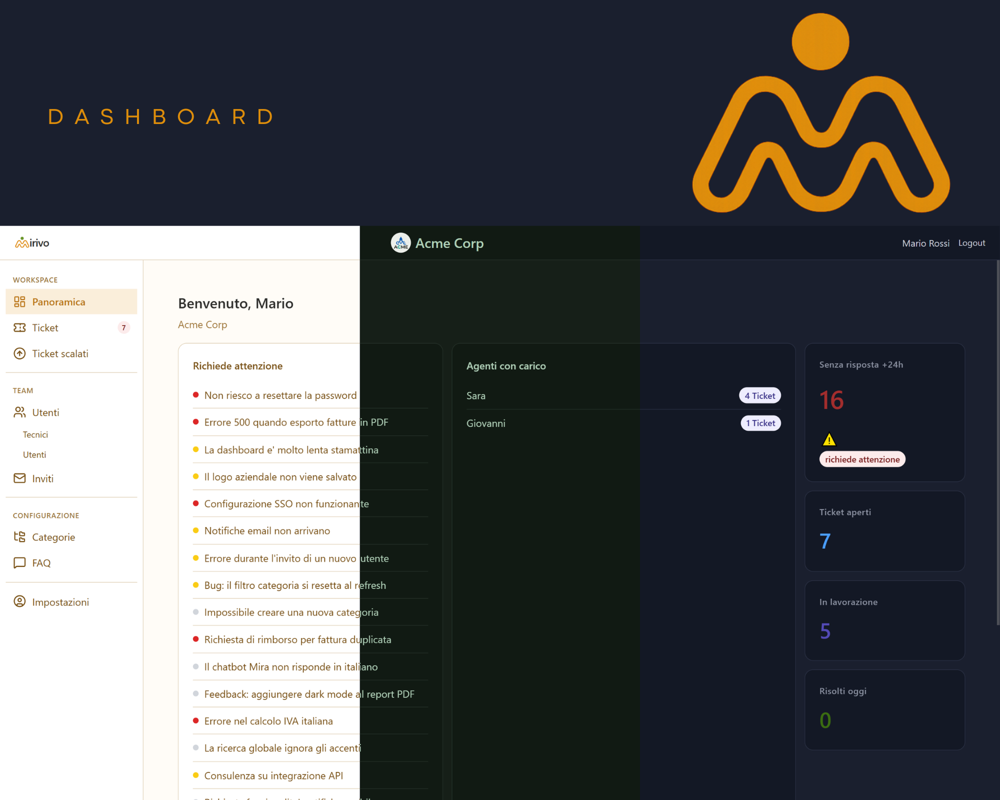
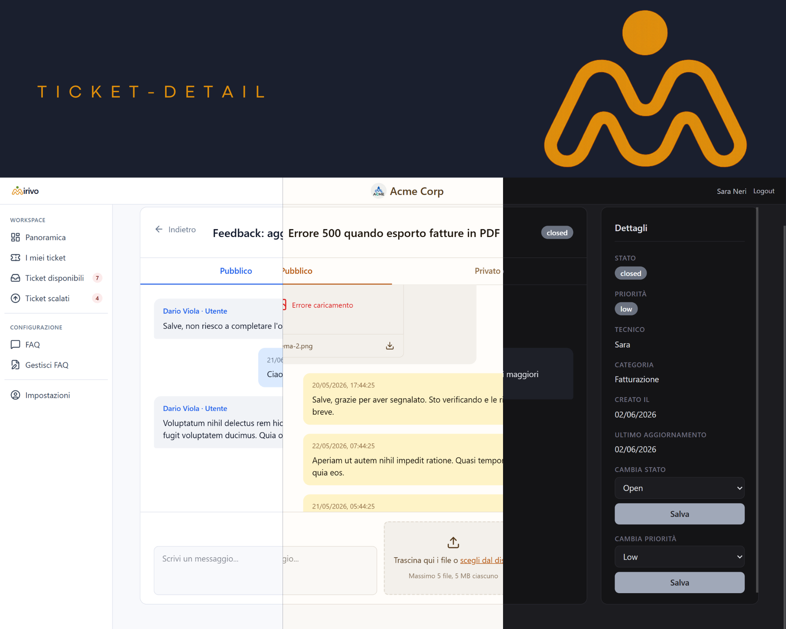
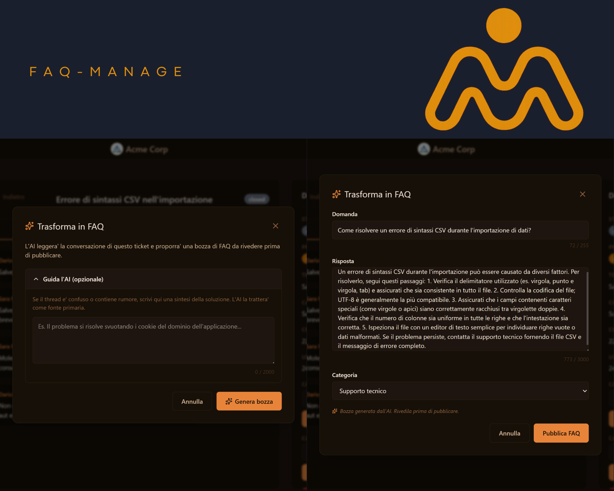

# Mirivo

> **Visto. Risolto.**

Helpdesk multi-tenant per la gestione di ticket di assistenza interna. Ogni azienda ha il proprio workspace isolato, con ruoli (Admin, Tecnico L1/L2, Utente), sistema di escalation, FAQ generate via AI dai ticket chiusi, chatbot e portale utente per l'apertura ticket.

**Demo live:** [mirivo.domenicofoglia.dev](https://mirivo.domenicofoglia.dev) - le credenziali di accesso sono visibili nella schermata di login (4 card demo).

**Repo frontend:** [Mirivo-helpdesk-frontend](https://github.com/DomenicoFoglia/Mirivo-helpdesk-frontend)

---

## Screenshot


*Dashboard tecnico con contatori ticket per stato*


*Dettaglio ticket con tab pubblico/privato per note interne*


*Generazione bozza FAQ da ticket chiuso via Gemini*

---

## Feature principali

- **Multi-tenancy per invito.** Ogni azienda crea un workspace e invita i dipendenti con link univoco. Isolamento totale tra workspace.
- **Autenticazione a sessione.** Migrata da token Bearer a sessione con cookie httpOnly per ridurre l'esposizione agli attacchi XSS: le credenziali non transitano né vengono salvate lato JavaScript.
- **Ruoli e livelli.** Admin, Tecnico L1, Tecnico L2, Utente. Ogni ruolo ha dashboard e permessi dedicati.
- **Sistema di escalation.** L1 puo' scalare ticket a L2 quando non ha competenze o autorizzazioni; L2 ha visibilita' sui ticket scalati e li prende in carico dal pool comune.
- **Messaggi pubblici e privati.** I tecnici possono lasciare note interne (private) invisibili all'utente, oppure rispondere pubblicamente.
- **Allegati sui messaggi.** Upload multi-file con preview, gestione autorizzazioni granulari sulla cancellazione.
- **Categorie e priorita'.** Filtri combinabili sulle liste principali (stato, priorita', categoria, ricerca testuale per titolo).
- **FAQ generate da AI.** Da un ticket chiuso, admin e tecnici L2 possono generare una bozza di FAQ via Gemini (Google Generative AI): il modello estrae domanda/risposta e segnala un possibile duplicato semantico se una FAQ simile esiste gia'. La bozza e' sempre editabile prima del salvataggio.
- **Portale utente.** Vista semplificata per l'apertura ticket, con lista personale e possibilita' di consultare le FAQ pubblicate.
- **Chatbot Mira (AI).** Assistente virtuale nel portale utente basato su Gemini 2.5 Flash. Risponde alle domande citando le FAQ aziendali (deflection), o, se la domanda non e' coperta, propone l'apertura di un ticket con titolo e categoria gia' suggeriti (escalation guidata). Scoping multi-tenant sulle FAQ, stateless (nessuna conversazione in DB), rate-limited a 20 richieste/min per utente.
- **Multi-tema.** Sistema di temi (Amber, Midnight, Light) via CSS variables, switcher persistente.
- **Multi-lingua.** i18n per italiano/inglese (in corso).

---

## Mira: chatbot AI integrato

Mira e' l'assistente virtuale di Mirivo, visibile nel portale utente come pulsante fluttuante in basso a destra. Basata su Google Gemini 2.5 Flash con output strutturato JSON via `responseSchema`.

**Due comportamenti:**
- **Deflection.** Se le FAQ aziendali coprono la domanda, Mira risponde direttamente citando la FAQ. Il ticket non viene aperto, il tecnico non viene disturbato.
- **Escalation guidata.** Se la domanda non e' coperta, Mira propone di aprire un ticket con **titolo e categoria gia' suggeriti dall'AI**. Un click e l'utente si ritrova il form di apertura ticket precompilato.

**Scelte tecniche:**
- **Scoping multi-tenant.** Nel prompt vengono iniettate solo le FAQ e le categorie della company dell'utente, mai dati di altre aziende.
- **Stateless.** Nessuna conversazione salvata in DB. La cronologia viaggia client-side e viene inviata al backend a ogni chiamata. Zero overhead di storage, privacy by design.
- **Output strutturato garantito** via `generationConfig.responseSchema` in formato OpenAPI-like: Gemini e' obbligata a rispettare la forma `{type: 'deflection'|'escalation', message: string, ticket_suggestion?: {title, category_id}}`. Niente parsing di free text, niente fence ```json da rimuovere.
- **Mini-RAG senza vector DB.** Per helpdesk aziendali la knowledge base resta compatta (<50 FAQ), quindi iniettare tutte le FAQ nel prompt come contesto e' sufficiente.
- **Rate limiting** a 20 richieste/min per utente autenticato (throttle Laravel con chiave utente).
- **Gestione errori a 3 livelli:** rete giu', HTTP non-2xx con caso 503 dedicato, JSON malformato. Ogni caso ha un messaggio user-friendly in italiano.

---

## Stack

**Backend**
- Laravel 13.7 + PHP 8.4.1
- MySQL 8.0.41
- Laravel Sanctum per autenticazione SPA a sessione (cookie httpOnly)
- Google Generative AI (Gemini) per generazione FAQ e Chatbot
- Nginx + PHP-FPM in produzione

**Frontend** ([repo separato](https://github.com/DomenicoFoglia/Mirivo-helpdesk-frontend))
- React 19 + Vite + TypeScript
- Zustand per state management
- Tailwind CSS + CSS variables per tema
- React Router DOM, Axios, Lucide React, react-hot-toast

**Infrastruttura**
- VPS Ubuntu 24 con Nginx + Let's Encrypt
- Deploy manuale via `git pull` + `npm run build`

---

## Architettura

**Isolamento multi-tenant:** ogni entità principale (User, Ticket, Category, FAQ, Tag, Invitation) ha una colonna `company_id`, chiave esterna verso `companies.id`. Le entità collegate indirettamente (Message, Attachment) raggiungono il tenant tramite la relazione con il ticket (`Attachment → Message → Ticket → company_id`). L'azienda corrente viene ricavata dall'utente autenticato e ogni query nei controller filtra esplicitamente per `company_id` (es. `Ticket::where('company_id', $user->company_id)`). Dove serve un controllo di accesso a livello di singola risorsa, interviene la `TicketPolicy` (vedi sotto).

**Ruoli e permessi:** `User::role` (`admin`/`agent`/`user`) e `User::level` (1/2 solo per agent). Le rotte sono raggruppate per prefisso e protette da middleware dedicati registrati in `bootstrap/app.php`:
- `is.admin` (`IsAdmin`)
- `is.agent` (`IsAgent`)
- `is.agent.l2` (`IsAgentL2`) per le azioni riservate agli L2 (pool ticket scalati)
- `is.user` (`IsUser`)
- `is.admin.or.agent.l2` (`IsAdminOrAgentL2`) per la gestione FAQ, condivisa tra admin e tecnici L2

**Autorizzazione a livello di risorsa:** la `TicketPolicy` implementa il metodo `view`, che verifica lo stesso `company_id` tra utente e ticket e, per gli utenti di ruolo `user`, la proprietà del ticket (un utente vede solo i propri). Le azioni di assegnazione, escalation, cambio stato/priorità e chiusura sono implementate direttamente nei controller di area (`AgentTicketController`, `AdminTicketController`), con i relativi controlli di stato e di appartenenza.

**Escalation:** un ticket `open` puo' passare a `escalated` da un L1. In quello stato entra nel pool di "Ticket scalati" visibili a tutti gli L2. Quando un L2 lo prende in carico, torna a `open` con nuovo `assignee_id` e livello effettivo L2.

**Autenticazione:** Sanctum in modalità SPA con sessione basata su cookie httpOnly (non token Bearer), abilitata tramite `statefulApi()` nel bootstrap. Al login Laravel crea la sessione e rigenera l'ID di sessione come protezione dalla session fixation; il browser allega il cookie automaticamente a ogni richiesta. Registrazione, login e logout standard. Reset password via email con token temporaneo. Le rotte sensibili (login, registrazione, reset, chatbot, generazione FAQ) hanno rate limiting via throttle.

**FAQ AI:** l'endpoint `POST /api/admin/tickets/{id}/faq-draft` (accessibile ad admin ed L2) chiama Gemini con il contesto del ticket chiuso e ritorna una bozza `{question, answer, similar_faq_id, similar_faq_reason}`. Il rilevamento di un possibile duplicato semantico avviene nella stessa chiamata: Gemini riceve anche l'elenco delle FAQ esistenti della company e, se ne individua una simile, ne segnala l'`id` e la motivazione. La categoria della FAQ è ereditata deterministicamente dal ticket di origine.

---

## Setup locale

**Prerequisiti**
- PHP 8.4+
- Composer 2+
- MySQL 8+
- Node.js 20+ (per il frontend, in repo separato)
- API key Google Generative AI (per FAQ e chatbot)

**Backend**

```bash
git clone https://github.com/DomenicoFoglia/Mirivo-helpdesk
cd Mirivo-helpdesk
composer install
cp .env.example .env
php artisan key:generate
```

Configura `.env`:

```env
APP_URL=http://localhost:8000

DB_CONNECTION=mysql
DB_HOST=127.0.0.1
DB_PORT=3306
DB_DATABASE=mirivo
DB_USERNAME=mirivo
DB_PASSWORD=***

GEMINI_API_KEY=***
GEMINI_MODEL=gemini-2.5-flash

MAIL_MAILER=log  # oppure smtp per email vere

FRONTEND_URL=http://localhost:5173
```

Migrazioni e seed. Il seeder di default crea l'azienda demo (Acme Corp) con le 4 card demo (Admin, Tecnico L1, Tecnico L2, Utente):

```bash
php artisan migrate:fresh --seed
```

Per popolare anche le FAQ di esempio (usate dal chatbot Mira e dalla ricerca FAQ), lancia il seeder dedicato:

```bash
php artisan db:seed --class=ChatbotFaqsSeeder
```

Avvia il server:

```bash
php artisan serve
```

Backend disponibile su `http://localhost:8000`.

**Frontend:** vedi [Mirivo-helpdesk-frontend](https://github.com/DomenicoFoglia/Mirivo-helpdesk-frontend).

---

## Struttura del repo

```
app/
  Http/
    Controllers/   # controller in namespace piatto (AdminTicketController, AgentTicketController, FaqController, ChatbotController, AuthController, ...)
    Middleware/    # IsAdmin, IsAgent, IsAgentL2, IsUser, IsAdminOrAgentL2, SetLocale
  Models/          # Ticket, User, Company, Category, Message, Attachment, Faq, Tag, Invitation
  Policies/        # TicketPolicy
  Services/        # GeminiService
database/
  migrations/
  seeders/         # DemoSeeder (azienda demo + 4 utenti, lanciato da --seed); ChatbotFaqsSeeder (FAQ di esempio, da lanciare a parte)
routes/
  api.php          # tutte le rotte API raggruppate per ruolo
```

---

## Deploy in produzione

Il deploy live gira su un VPS Ubuntu con Nginx + PHP-FPM + MySQL 8, dominio con Let's Encrypt. Flusso:

```bash
# sul VPS
cd /var/www/mirivo
git pull
composer install --no-dev --optimize-autoloader
php artisan migrate --force        # solo se ci sono nuove migration
php artisan config:cache
php artisan route:cache
php artisan view:cache
```

Frontend deployato separatamente: `git pull` + `npm run build`, output in `dist/` servito da Nginx.

---

## Stato del progetto

Progetto in produzione dal 27 luglio 2026. Sviluppo attivo, focus su rifinitura UX e piccole feature.

**Roadmap breve:**
- Colonna `assigned_at` per data presa in carico nella lista tecnico
- Landing di portfolio su `domenicofoglia.dev`
- Completare i18n IT/EN
- Cleanup layer API frontend
- `LevelRoute` component per bloccare accessi frontend granulari per livello

---

## Autore

Sviluppato da **Domenico Foglia** come progetto di portfolio full-stack.

- Portfolio: [domenicofoglia.dev](https://domenicofoglia.dev)
- Demo Mirivo: [mirivo.domenicofoglia.dev](https://mirivo.domenicofoglia.dev)
- LinkedIn: [domenico foglia linkedin](https://www.linkedin.com/in/domenicofoglia)

---

## Licenza

Codice sorgente disponibile per consultazione a fini di valutazione. Nessuna licenza open source formale al momento.